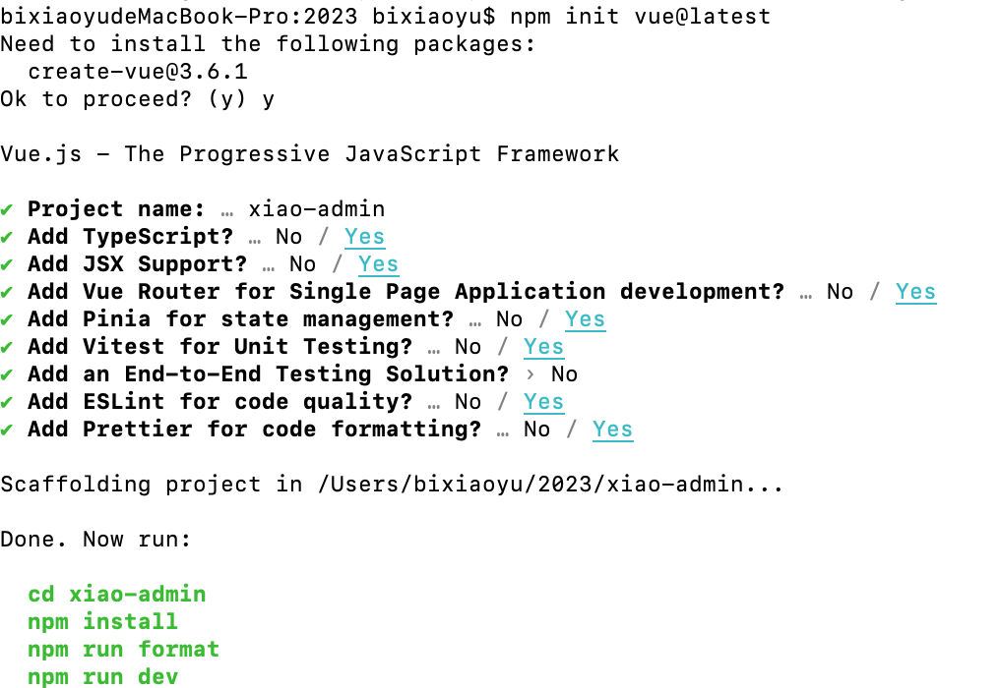
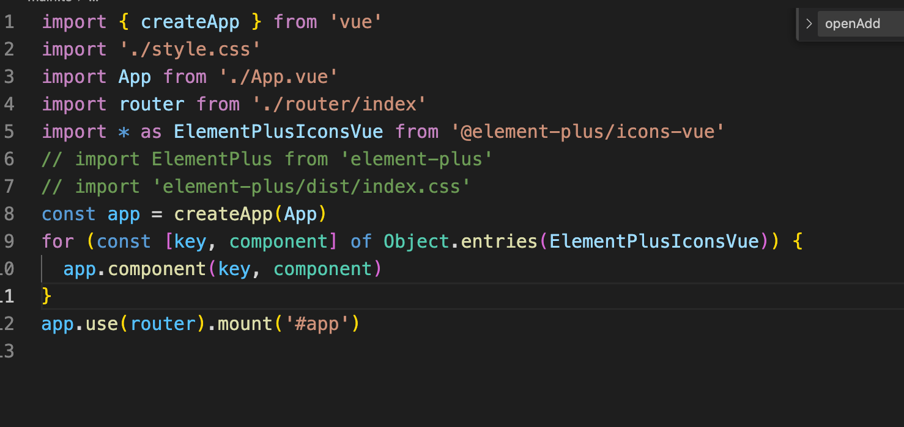

# 4.1 如何初始化一个vue3 项目
开始之前,我们先来了解一下vite,Vite本身与框架无关，是一套基于插件的项目工程架构，是新的一套对开发者比较友好的一套构建和开发的工具.

它的特点就是快，它不会随着项目的规模的变大而让你的开发过程变得卡顿。总的来说就是：Vite是一个开发构建工具，开发过程中它利用浏览器的native ES Module特性按需导入源码，预打包依赖。是为了开发者量身定做的一套开发工具。特点：启动快，更新快。

我们观察Vite工程项目的结构发现在根目录出现了一个index.html文件，这个文件有点相当于我们之前的webpack工程项目里html模版入口文件。其中最大的变化就是script标签引用是用ES6的原生模块化type="module"进行引用，即是esmodule。

 ```
  <script type="module" src="/src/main.ts"></script> 
 ```
 初始化 ,node 需要安装最新稳定版.目前版本v18.14.1.node版本管理 mac可以使用n,windows使用nvm进行版本切换.
 #### pnpm 

 performant npm ，意味“高性能的 npm”。pnpm由npm/yarn衍生而来，解决了npm/yarn内部潜在的bug，极大的优化了性能，扩展了使用场景。被誉为“最先进的包管理工具”
 二、特点：

速度快、节约磁盘空间、支持monorepo、安全性高

pnpm 相比较于 yarn/npm 这两个常用的包管理工具在性能上也有了极大的提升，根据目前官方提供的 benchmark 数据可以看出在一些综合场景下比 npm/yarn 快了大概两倍。

三、存储管理：

按内容寻址、采用symlink

四、依赖管理：

npm1、npm2采用递归管理，npm3、npm3+、yarn依赖扁平化管理消除依赖提升。

pnpm依赖策略：消除依赖提升、规范拓扑结构

五、安全
之前在使用 npm/yarn 的时候，由于 node_module 的扁平结构，如果 A 依赖 B， B 依赖 C，那么 A 当中是可以直接使用 C 的，但问题是 A 当中并没有声明 C 这个依赖。因此会出现这种非法访问的情况。 但 pnpm 自创了一套依赖管理方式，很好地解决了这个问题，保证了安全性。

六、安装：

 ```
 npm i pnpm -g
 ```
 六、安装：

 ```
npm i pnpm -g
 ```
七、查看版本信息： 

 ```
 pnpm -v

  ```
八、升级版本

```
pnpm add -g pnpm to update 

```

九、设置源： 

```
pnpm config get registry //查看源
pnpm config set registry https://registry.npmmirror.com //切换淘宝源 

```
十 安装项目依赖 

```
pnpm install
```

十一 运行项目

```
pnpm run dev 

```
 ### 初始化 项目 npm/pnpm init vue@latest 

 

 Project name 输入项目名称,如直接回车 会默认值,Add TypeScript 是否添加ts,Add JSX Support 是否添加jsx的支持,Add Vue Router for Single Page Application development? 是否添加单页应用路由.Add Pinia for state management? 是否添加状态管理插件,相当于vue2 里的vuex.Add Vitest for Unit Testing? 是否添加vitest测试,是vitest是官方提供的.Add an End-to-End Testing Solution?  是否添加端到端测试解决方案.Add ESLint for code quality? 是否添加eslint.Add Prettier for code formatting?  是否添加Prettier 用作代码格式化.

 ### 项目启动

```
 cd <your-project-name>
 pnpm install
 pnpm run dev

 ```
 ### vscode配置 

  vscode 需要重新配置插件,还需要去掉之前常用的格式化插件, 使用 [Volar 扩展](https://marketplace.visualstudio.com/items?itemName=Vue.volar)

### 安装配置 

安装 vue-router、element-plus、scss

```
 pnpm install vue-router
 pnpm install element-plus
 pnpm install sass

 ```
 修改main.ts 文件

 

### 进行router配置

在src目录下,新建router文件夹,下面新建index.ts文件,
 在main.ts里蹈入路由文件,并绑定在app上.

 ```
import { createRouter, createWebHistory } from "vue-router";
const router = createRouter({
  history: createWebHistory(),
  routes: [
    { name: 'home', path: '/', component: () => import('../views/HomePage.vue') },
    { name: 'test', path: '/test', component: () => import('../views/TestPage.vue') },
  ]
})
export default router

 ```
引入[elemet-plus](https://element-plus.gitee.io/zh-CN/guide/design.html) ,如果你对打包后的文件大小不是很在乎，那么使用完整导入会更方便。

```
// main.ts
import { createApp } from 'vue'
import ElementPlus from 'element-plus'
import 'element-plus/dist/index.css'
import App from './App.vue'

const app = createApp(App)

app.use(ElementPlus)
app.mount('#app')

```
### 按需导入

需要使用额外的插件来导入要使用的组件。

首先你需要安装unplugin-vue-components 和 unplugin-auto-import这两款插件

```
npm install -D unplugin-vue-components unplugin-auto-import

```
### Volar 支持

如果您使用 Volar，请在 tsconfig.json 中通过 compilerOptions.type 指定全局组件类型。

```
// tsconfig.json
{
  "compilerOptions": {
    // ...
    "types": ["element-plus/global"]
  }
}
```
然后把下列代码插入到你的 Vite 的配置文件中
```
// vite.config.ts
import { defineConfig } from 'vite'
import AutoImport from 'unplugin-auto-import/vite'
import Components from 'unplugin-vue-components/vite'
import { ElementPlusResolver } from 'unplugin-vue-components/resolvers'

export default defineConfig({
  // ...
  plugins: [
    // ...
    AutoImport({
      resolvers: [ElementPlusResolver()],
    }),
    Components({
      resolvers: [ElementPlusResolver()],
    }),
  ],
})
```